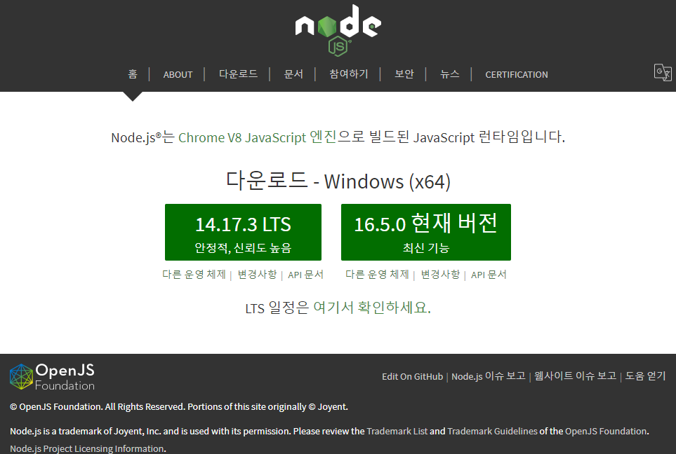
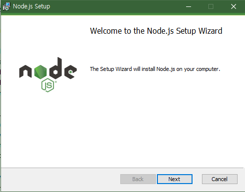
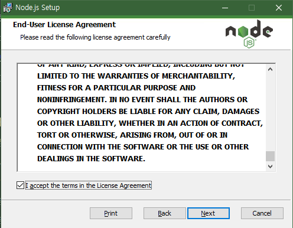
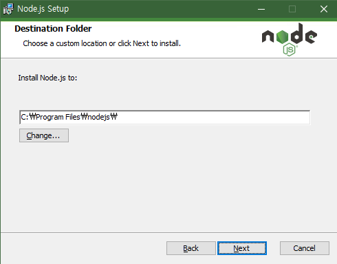
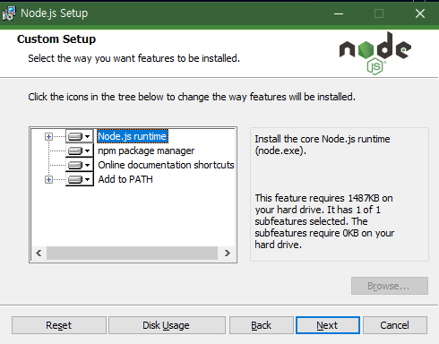
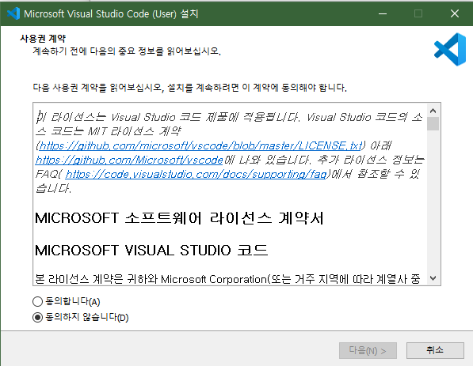
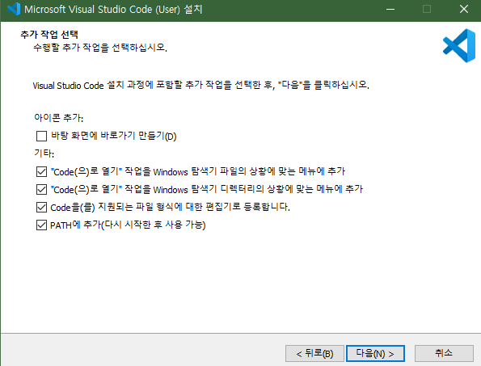

#개발 환경
  
개발 환경은 프로그램을 개발하는것에 있어
공간과 같은 한다.

만약 우리가 카페와 같은 곳에 있는다면 공부를 하는것에 대해 불편함이 없겠지만
놀고자 한다면 문제가 생길 수 있다.
반대로 우리가 노래방에 간다면 신나게 놀순 있겠지만
조용한 환경 아래에서 공부하기엔 어려움이 있다.
  
이처럼 프로그래밍을 할 때
우리가 개발 환경을 잘못 설정한다면
우리가 이루고자 하는 내용을 이룰 수 없게 되니
주의하길 바란다.
  
  
###Node.js?
  
우리가 사용할 언어는 Javascript다
그러나 javascript라는 언어는 여러 개발환경이 있는데
대표적으로 Node.js와 Html이 있다.
Html은 웹을 기반으로 사용되는 javascript의 환경을 제공하지만
Node.js는 더 넓은 범위로
서버나 애플리케이션 등등의 프로그램들을 제작 가능하다.
우리는 저 2가지 환경중 Node.js를 사용할 것이므로
만약 다른 강좌를 함께 볼 경우
Node.js에 대한 강좌를 찾아보길 바란다.
  
  
###Node.js 설치
  
Node.js를 설치하는 법은 매우 간단하다.
먼저 [Node.js의 공식 사이트](https://nodejs.org/ko/)에 접속하자

사이트에 접속하면 위와 같은 사진이 우리를 반겨줄 것이다.
위 사이트에서는 2가지 버전을 다운할 수 있는데
LTS 버전과 현재 버전이 있다.
LTS 버전은 장기적으로 안정적인 지원을 통해 보안에 초점을 두었고
현재 버전은 잦은 업데이트를 통해 추가 하거나 수정, 삭제하는 버전이다.
우리는 간단하게 js에 대한 공부를 하는 것 이므로
두 버전중 무엇을 사용해도 상관 없지만
그래도 필자는 공부를 하는 목적이므로 현재버전을 추천한다.
설치기를 실행한다면 위와 같은 화면이 우리를 반겨줄텐데

Next를 누르자

그럼 위와 같이 Node.js에 대한 라이센스 동의서가 뜰텐데 잘 읽어본 뒤 동의후 넘어가자

그럼 위와 같이 Node.js를 설치할 위치를 물어볼 것이다.
저곳은 최대한 건들지 않을것을 추천하지만
만약 C드라이브에 용량이 부족하다면
D나 E같이 다른 드라이브에 옮기는 것을 추천한다.

다음은 위와 같이 커스텀 설치가 가능한 화면이 나오는데
이것은 부디 건들지 말길 바란다...

그럼 마지막으로 Node.js를 사용하며 개발자들은
`모듈`이라는 것을 사용하게 되는데
`모듈에 대한것은 뒤에 더 자세히 다룰것이다.`
이를 사용하게 될 경우 한번씩 일부 도구(Python이나 Visual Studio Build Tools)가 필요하게 될 경우가 있다.
그럴 경우를 대비하여 미리 설치를 하겠냐는 내용인데
필자는 이를 스킵하여 진행하였다.
`필자가 넘어간 이유는 사용하는 모듈들이 이를 대부분 요청하지 않는 것과 설치가 오래 걸리기 때문이지 사용자의 환경에 부정적인 영향을 주는것은 아니다.`
만약 더욱 깊숙히 공부하고 알아가려고 한다면
이를 체크후 넘어가는 것이 좋다.

드디어 모든 설치에 대한 질문이 끝났다.
이제 설치를 눌러 모든 설치가 될때까지 기다리면 끝이다.
  

###편집기?
  
개발 환경을 정했으니 이제 우리는 제작을 하면 된다.
그러나 어떻게 제작을 해야할지는 모를것이다.
프로그램을 제작할 땐 그냥 새로운 파일을 만든 후
파일의 이름을 `파일명.js` 와 같이 저장하면 된다.
`만약 사용자의 환경에서 .txt나 .hwp와 같이 파일의 확장자가 나오지 않을 경우`
[이곳](https://joyfulhome.tistory.com/45)`을 참고하여 확장자가 나오도록 해보자`
`[출처] 즐거운 우리집님의 티스토리(https://joyfulhome.tistory.com/45\)`
이후 파일 내에서 작성을 하면 되지만 
설마... 메모장으로 작업하려 하진 않을 것이라고 `굳게` 믿는다..
  
  
###VSC?
  
VSC(Visual Studio Code)는 마이크로 소프트에서 제작된 편집기로
소스 코드 편집과 디버깅, 프로그래밍 구문 추천과 같은 기능을 지원하고 있다.
다른 많은 편집기도 많지만
필자는 비교적 사용이 쉬운 이를 추천한다.
VSC는 [이곳](https://code.visualstudio.com/docs/?dv=win)에 가면 자동으로 다운이 시작된다.

다운을 시작하면 처음에 위 화면같이
라이센스에 대한 동의를 구합니다.
잘 읽어보신뒤 동의를 하시길 바라며

그럼 다음과 같이 추가 작업에 대해 질문을 하는데
위 사진과 같이 설정하는 것을 추천합니다.
이후 설치를 진행하면 끝입니다.

#작성중..
